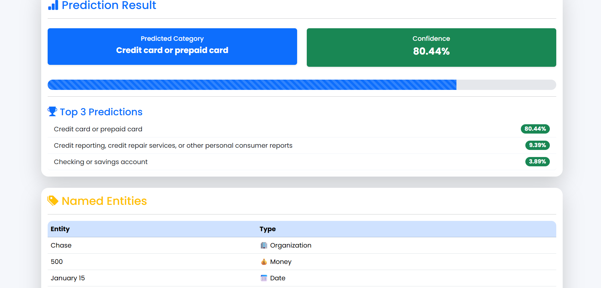
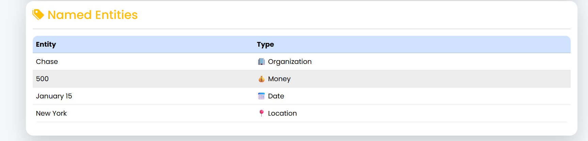
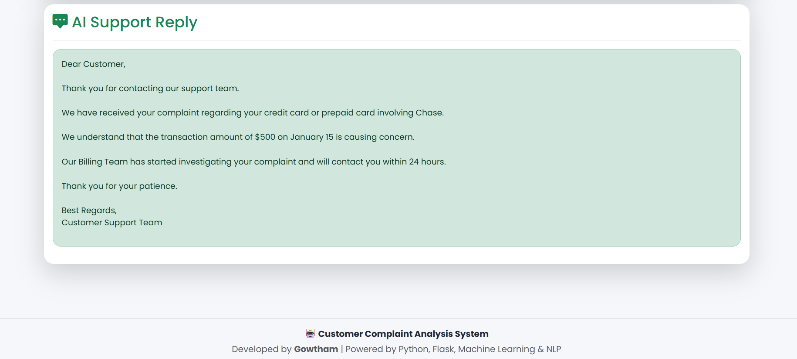
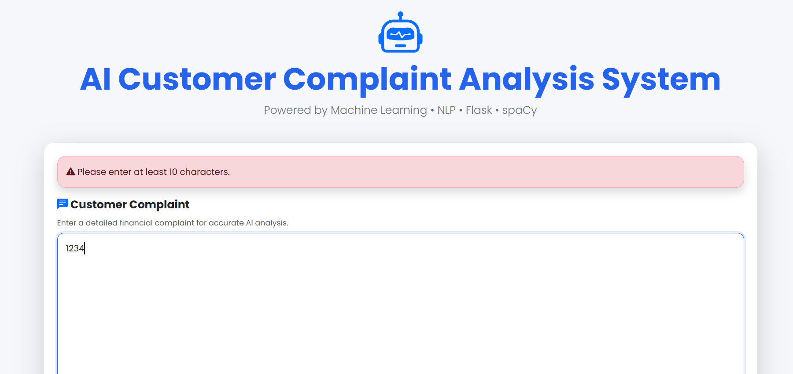

# 🤖 AI Customer Complaint Analysis System

An AI-powered web application that classifies financial customer complaints using Machine Learning and Natural Language Processing (NLP).

The application predicts the complaint category, extracts important entities from the complaint, and generates an intelligent automated customer support reply.

---

## 🚀 Features

- Customer Complaint Classification
- Machine Learning Prediction
- TF-IDF Vectorization
- Logistic Regression Classifier
- Confidence Score
- Top 3 Predictions
- Named Entity Recognition (spaCy)
- Personalized AI Support Reply
- Low Confidence Detection
- Input Validation
- Professional Bootstrap UI

---

## 🛠️ Technologies Used

- Python
- Flask
- Scikit-learn
- spaCy
- Pandas
- NumPy
- HTML
- CSS
- Bootstrap 5

---

## 📂 Project Structure

```
Customer-Support-Ticket-Classifier/

│
├── app/
│   ├── static/
│   ├── templates/
│   └── app.py
│
├── src/
│   ├── train_model.py
│   ├── predict.py
│   ├── preprocess_text.py
│   ├── ner.py
│   └── auto_reply.py
│
├── data/
│
├── models/
│
├── screenshots/
│
├── requirements.txt
└── README.md
```

---

## 📊 Model Performance

Algorithm:
- Logistic Regression

Vectorizer:
- TF-IDF

Accuracy:
- **84.19%**

---

# 📸 Application Screenshots

## Home Page


---

## Prediction Result



---

## Named Entity Recognition



---

## AI Support Reply



---

## Validation



---

## Low Confidence Detection


---

## Future Improvements

- Deep Learning Models
- Transformer-based NLP
- Multilingual Complaint Support
- Live Database Integration
- REST API
- Cloud Deployment

---

## 👨‍💻 Developer

**Gowtham**

Built using Python, Flask, Machine Learning and NLP.